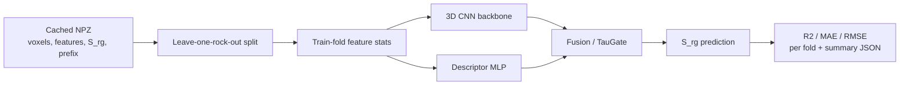

<div align="center">


# Digital-Rock-SrgNet

**Volumetric neural surrogates for residual gas saturation in digital rock cores.**

Digital-Rock-SrgNet learns `S_rg` directly from binary pore geometry and morphology descriptors,
so model variants can be evaluated without repeatedly running expensive pore-scale simulators.

[](LICENSE)
[](https://www.python.org/)
[](https://pytorch.org/)
[](https://lightning.ai/)
[](#project-status)

</div>

---

## At a Glance

| Question | Answer |
| --- | --- |
| What does it predict? | Residual gas saturation, `S_rg in [0, 1]` |
| What are the inputs? | 3D binary pore voxels plus morphology descriptors |
| What is the main validation rule? | Leave-one-rock-out cross-validation by parent-core `prefix` |
| What is the current main model? | `PoreDualNet`, a dual-path CNN with residual TauGate and descriptor shortcut |
| Is data included? | No. The repository ships modeling code and the expected `.npz` data contract |

## Contents

- [Quick Start](#quick-start)
- [Why This Repo Exists](#why-this-repo-exists)
- [Workflow](#workflow)
- [Model Zoo](#model-zoo)
- [Data Contract](#data-contract)
- [Repository Layout](#repository-layout)
- [Project Status](#project-status)
- [Citation](#citation)
- [License](#license)
- [中文简述](#中文简述)

## Quick Start

```bash
git clone https://github.com/YonganZhang/digital-rock-srg-net.git
cd digital-rock-srg-net
python -m pip install -r requirements.txt
```

Run the built-in smoke test. It creates a synthetic `.npz`, loads the dataset utilities, builds
`PoreDualNet`, runs a forward and backward pass, and checks that predictions stay finite.

```bash
python quick_test.py
```

Train the current dual-path model with grouped cross-validation:

```bash
python train.py \
  --data data/processed/voxel_128.npz \
  --model poredualnet \
  --epochs 80 \
  --scheduler cosine \
  --augment \
  --gpu 0 \
  --tag poredualnet_cosine_aug
```

Run two reference baselines:

```bash
# Lightweight voxel + descriptor CNN
python train.py --data data/processed/voxel_128.npz --model simple --epochs 80 \
  --scheduler cosine --augment --gpu 0 --tag simple_cosine_aug

# Descriptor-only baseline
python train.py --data data/processed/voxel_128.npz --model phi --epochs 30 \
  --gpu 0 --tag phi_baseline
```

Training writes fold metrics and aggregate scores to:

```text
runs/p1_<model>_<tag>.json
```

## Why This Repo Exists

Residual gas saturation is normally estimated through pore-scale simulation on voxelized rock
samples. That workflow is accurate but slow when repeated across model comparisons, ablations, and
cross-validation folds.

This repository provides a compact research codebase for replacing that repeated simulation loop
with trainable 3D surrogates:

```text
voxelized pore geometry + morphology descriptors -> neural surrogate -> S_rg
```

The important constraint is leakage. Sub-volumes cut from the same parent rock are correlated, so
random train/test splits overstate generalization. The training code groups samples by parent-rock
`prefix` and validates on one held-out core at a time.

## Workflow



Implementation choices that matter:

| Choice | Why it matters |
| --- | --- |
| Grouped CV by `prefix` | Prevents correlated sub-volumes from crossing train and validation folds |
| Train-fold-only normalization | Keeps descriptor statistics leakage-safe |
| X-Y augmentation only | Preserves the Z through-flow direction |
| Logit target transform | Trains most linear-head models in logit space, then maps back to `[0, 1]` |
| Built-in sigmoid for `PoreDualNet` | Uses direct `S_rg` training for the dual-path family |

## Model Zoo

All models consume `voxel` and `features` tensors and return one scalar prediction per sample.
Select a model with `--model`.

| Group | CLI name | Main class | Purpose |
| --- | --- | --- | --- |
| Baseline | `phi` | `PhiOnlyBaseline` | Descriptor-only sanity baseline |
| Baseline | `voxel_only_cnn` | `VoxelOnlyCNN` | Geometry-only baseline |
| Lightweight CNN | `simple` | `SimpleSrgNet` | 3-layer 3D-CNN plus descriptor MLP |
| Lightweight CNN | `simple_sigmoid` | `SimpleSrgNetSigmoid` | `simple` with sigmoid head |
| Lightweight CNN | `simple_taugate` | `SimpleTauGateNet` | `simple` with tau-guided channel gating |
| ResNet family | `resnet18_concat` | `ResNetSrgNet` | 3D ResNet with concatenation fusion |
| ResNet family | `resnet18_crossattn` | `ResNetSrgNet` | 3D ResNet with cross-attention-style fusion |
| ResNet family | `resnet18_film` | `ResNetSrgNet` | 3D ResNet with FiLM modulation |
| Compact backbones | `resnet10_tiny_crossattn` | `ResNet10Tiny` | Smaller ResNet-style backbone |
| Compact backbones | `ms_porenet_crossattn` | `MSPoreNet` | Multi-scale 3D Inception-style backbone |
| Compact backbones | `porecoat_crossattn` | `PoreCoAt` | Compact convolution + attention backbone |
| Compact backbones | `poreformer_crossattn` | `PoreFormer` | Lightweight volumetric transformer variant |
| TauGate family | `poreflownet` | `PoreFlowNet` | TauGate plus cross-attention-style fusion |
| TauGate family | `poreflownet_no_taugate` | `PoreFlowNet_NoTauGate` | Ablation without TauGate |
| TauGate family | `poreflownet_no_crossattn` | `PoreFlowNet_NoCrossAttn` | Ablation with concat fusion |
| Dual-path family | `poredualnet` | `PoreDualNet` | Residual TauGate plus descriptor shortcut |
| Dual-path family | `poredualnet_no_taugate` | `PoreDualNet_NoTauGate` | Ablation without residual TauGate |
| Dual-path family | `poredualnet_no_shortcut` | `PoreDualNet_NoShortcut` | Ablation without descriptor shortcut |

Reusable building blocks live in [`models_3d.py`](models_3d.py): `BasicBlock3D`, `ResNet3D`,
`ConcatFusion`, `CrossAttnFusion`, `FiLMFusion`, `TauGate`, `ResidualTauGate`, Inception-style
blocks, MBConv blocks, and lightweight transformer blocks.

## Data Contract

The dataset is not distributed here. Build a cached `.npz` file offline and pass it with `--data`.
The current loader in [`data.py`](data.py) expects:

| Key | Shape | Dtype | Required | Meaning |
| --- | --- | --- | --- | --- |
| `voxel` | `(N, D, D, D)` | `uint8` | yes | Binary pore geometry, cast to `float32` per batch |
| `features` | `(N, F)` | `float32` | yes | Morphology descriptors |
| `Srg` | `(N,)` | `float32` | yes | Residual gas saturation target |
| `sample_id` | `(N,)` | string | yes | Sub-volume sample id |
| `prefix` | `(N,)` | string | yes | Parent-rock id used for grouped CV |
| `feature_names` | `(F,)` | string | yes | Descriptor names |
| `K` | `(N,)` | `float32` | optional | Permeability value retained by older caches |
| `logK` | `(N,)` | `float32` | optional | Log-permeability value retained by older caches |

`voxel` stays as `uint8` in memory and is cast inside `RockDataset.__getitem__`, which keeps large
volumes practical to load.

## Repository Layout

```text
digital-rock-srg-net/
├── assets/digital-rock-srgnet.svg  # README project mark
├── data.py                         # cached dataset loader and grouped splitting
├── model.py                        # lightweight baselines
├── models_3d.py                    # 3D backbones, fusion modules, PoreFlowNet/PoreDualNet variants
├── quick_test.py                    # synthetic smoke test for PoreDualNet
├── train.py                        # cross-validation training entry point
├── requirements.txt
├── LICENSE
└── README.md
```

## Project Status

This is active research code for a digital-rock surrogate-modeling study. It is not a packaged
library and does not ship pretrained weights or private voxel data.

Current status:

| Item | State |
| --- | --- |
| Public code | Model architectures, data loader, training loop, smoke test |
| Private assets | Digital rock voxel dataset and descriptors are not included |
| Main model path | `PoreDualNet` and ablations |
| Validation protocol | Leave-one-rock-out grouped CV |
| Output artifact | `runs/p1_<model>_<tag>.json` |

## Citation

A paper describing this work is in preparation. Until then, cite the repository:

```bibtex
@software{wang_digital_rock_srgnet_2026,
  author  = {Wang, Peng and collaborators},
  title   = {Digital-Rock-SrgNet: 3D-CNN surrogate models for residual-gas-saturation
             prediction from digital rock cores},
  year    = {2026},
  url     = {https://github.com/YonganZhang/digital-rock-srg-net}
}
```

## License

Released under the [MIT License](LICENSE). The accompanying dataset is not distributed in this
repository and is not covered by this software license.

## 中文简述

这个仓库是数字岩心 `S_rg` 预测的研究代码：输入三维孔隙体素和形态学特征，训练 3D-CNN
代理模型，并用按母岩心分组的 leave-one-rock-out 交叉验证避免数据泄漏。数据本身不随仓库
公开，仓库只包含模型、数据接口、训练脚本和快速 smoke test。
