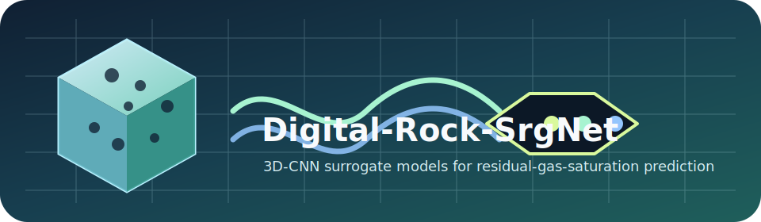
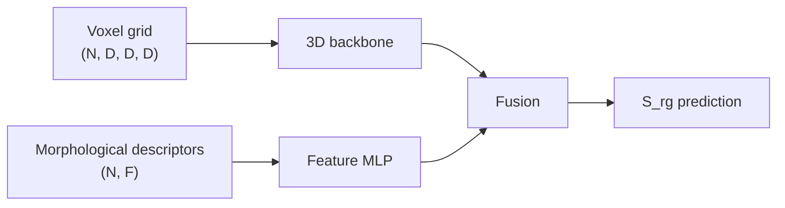
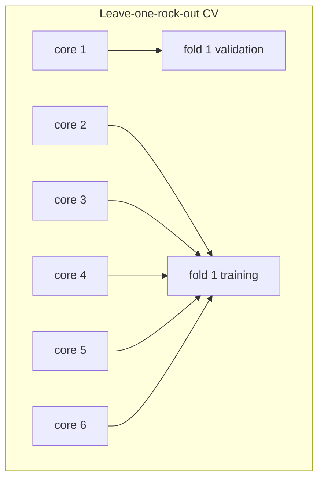

<div align="center">



# Digital-Rock-SrgNet

**3D-CNN surrogate models for predicting residual gas saturation from digital rock cores.**

Replace slow pore-scale flow simulation loops with trainable volumetric models that fuse binary
voxel geometry and morphological descriptors under leakage-safe leave-one-rock-out evaluation.

[](LICENSE)
[](https://www.python.org/)
[](https://pytorch.org/)
[](https://lightning.ai/)
[](#project-status)

</div>

---

## Contents

- [Why This Exists](#why-this-exists)
- [What Is Included](#what-is-included)
- [Quick Start](#quick-start)
- [Model Zoo](#model-zoo)
- [Method Notes](#method-notes)
- [Dataset Format](#dataset-format)
- [Repository Layout](#repository-layout)
- [Project Status](#project-status)
- [Citation](#citation)
- [License](#license)

## Why This Exists

Residual gas saturation (`S_rg`) is usually estimated by running computationally expensive
pore-scale simulation on voxelized rock samples. This repository provides a compact research
codebase for learning that mapping directly:

```text
3D pore voxels + morphology descriptors -> neural surrogate -> S_rg in [0, 1]
```

The code is built around the practical constraints of this dataset: roughly hundreds of samples,
strong correlation among sub-volumes from the same parent core, and a need to avoid validation
leakage. The training loop therefore uses grouped cross-validation by parent-rock prefix instead
of random splitting.

## What Is Included

| Area | Included |
| --- | --- |
| Data interface | Cached `.npz` loader for voxel grids, tabular descriptors, targets, and group ids |
| Splitting protocol | Leave-one-rock-out cross-validation using the `prefix` parent-core key |
| Architectures | Lightweight 3D CNNs, descriptor-only baseline, 3D ResNet, fusion variants, PoreFlowNet |
| Fusion modules | Concatenation, cross-attention-style gating, FiLM, and TauGate components |
| Training | PyTorch Lightning trainer with per-fold `R2`, `MAE`, `RMSE`, augmentation, and JSON summaries |

The dataset itself is not distributed in this repository.

## Quick Start

```bash
git clone https://github.com/YonganZhang/digital-rock-srg-net.git
cd digital-rock-srg-net
python -m pip install -r requirements.txt
```

Train the lightweight baseline with leakage-safe grouped CV:

```bash
python train.py \
  --data data/processed/voxel_128.npz \
  --model simple \
  --epochs 80 \
  --scheduler cosine \
  --augment \
  --gpu 0 \
  --tag simple_cosine_aug
```

Run a descriptor-only baseline for comparison:

```bash
python train.py \
  --data data/processed/voxel_128.npz \
  --model phi \
  --epochs 30 \
  --gpu 0 \
  --tag phi_baseline
```

Training writes fold metrics and aggregate scores to:

```text
runs/p1_<model>_<tag>.json
```

## Model Zoo

All models consume `voxel` and `features` tensors and predict one scalar residual-gas-saturation
value per sample.

| CLI name | Main class | Role |
| --- | --- | --- |
| `phi` | `PhiOnlyBaseline` | Descriptor-only sanity baseline |
| `simple` | `SimpleSrgNet` | Lightweight 3-layer 3D-CNN + descriptor MLP |
| `simple_sigmoid` | `SimpleSrgNetSigmoid` | Same backbone with sigmoid output head |
| `simple_taugate` | `SimpleTauGateNet` | Lightweight CNN with tau-guided channel gating |
| `resnet18_concat` | `ResNetSrgNet` | 3D ResNet with concatenation fusion |
| `resnet18_crossattn` | `ResNetSrgNet` | 3D ResNet with cross-attention-style fusion |
| `resnet18_film` | `ResNetSrgNet` | 3D ResNet with FiLM feature modulation |
| `resnet10_tiny_crossattn` | `ResNet10Tiny` | Smaller ResNet-style backbone |
| `ms_porenet_crossattn` | `MSPoreNet` | Multi-scale 3D Inception-style backbone |
| `porecoat_crossattn` | `PoreCoAt` | Compact convolution + attention backbone |
| `poreformer_crossattn` | `PoreFormer` | Lightweight volumetric transformer variant |
| `poreflownet` | `PoreFlowNet` | TauGate + cross-attention-style fusion model |
| `poreflownet_no_taugate` | `PoreFlowNet_NoTauGate` | PoreFlowNet ablation without TauGate |
| `poreflownet_no_crossattn` | `PoreFlowNet_NoCrossAttn` | PoreFlowNet ablation with concat fusion |
| `voxel_only_cnn` | `VoxelOnlyCNN` | Geometry-only baseline without descriptors |

## Method Notes





Key implementation choices:

- Sub-volumes from the same parent rock are never split across train and validation folds.
- Feature normalization statistics are computed on each training fold only.
- Augmentation is restricted to rotations and flips in the X-Y plane; the Z axis is kept as the
  through-flow direction.
- The default `logit` target transform trains on logit-space `S_rg` and maps predictions back to
  `[0, 1]` for evaluation.

## Dataset Format

`data.py` expects a cached `.npz` file with these arrays:

| Key | Shape | Dtype | Meaning |
| --- | --- | --- | --- |
| `voxel` | `(N, D, D, D)` | `uint8` | Binary pore geometry, loaded as `uint8` and cast per batch |
| `features` | `(N, F)` | `float32` | Morphological descriptors |
| `Srg` | `(N,)` | `float32` | Residual gas saturation target in `[0, 1]` |
| `K` | `(N,)` | `float32` | Permeability value retained in the cache |
| `logK` | `(N,)` | `float32` | Log-permeability value retained in the cache |
| `sample_id` | `(N,)` | string | Sub-volume sample id |
| `prefix` | `(N,)` | string | Parent-rock id used for grouped CV |
| `feature_names` | `(F,)` | string | Descriptor names |

To use your own data, build this `.npz` file offline and pass it with `--data`.

## Repository Layout

```text
digital-rock-srg-net/
├── assets/digital-rock-srgnet.svg  # README project mark
├── data.py                         # cached dataset loader and grouped splitting
├── model.py                        # lightweight baselines
├── models_3d.py                    # 3D backbones, fusion modules, PoreFlowNet variants
├── train.py                        # cross-validation training entry point
├── requirements.txt
├── LICENSE
└── README.md
```

## Project Status

This is active research code for a digital-rock surrogate-modeling study. It is not a packaged
library and does not ship pretrained weights or private voxel data.

Current benchmark notes in this branch:

- `SimpleSrgNet` is the lightweight baseline for fast iteration.
- `PoreFlowNet` contains the TauGate and fusion ablation path used for model comparisons.
- Reported metrics should be interpreted under leave-one-rock-out CV, not random train/test split.

## Citation

A paper describing this work is in preparation. Until then, cite the repository:

```bibtex
@software{wang_digital_rock_srgnet_2026,
  author  = {Wang, Peng and collaborators},
  title   = {Digital-Rock-SrgNet: 3D-CNN surrogate models for residual-gas-saturation
             prediction from digital rock cores},
  year    = {2026},
  url     = {https://github.com/YonganZhang/digital-rock-srg-net}
}
```

## License

Released under the [MIT License](LICENSE). The accompanying dataset is not distributed in this
repository and is not covered by this software license.
